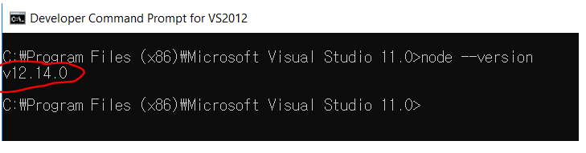
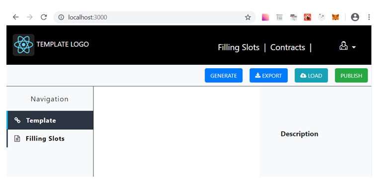

# How to Publish in Windows 

### 1.	Download and Install npm

  -	Download node-v12.x.x.msi from https://nodejs.org/en/download/  
  -	Install node-v12.x.x.msi by clicking double.  
     To confirm that npm is installed, open the command prompt window and type like “node --version”.  
 
     

### 2.	Install and Run the DB.
  This project uses the mongodb as Database. 
  -	Download mongodb installer(windows version) from https://www.mongodb.com/dr/fastdl.mongodb.org/win32/mongodb-win32-x86_64-2012plus-4.2.8-signed.msi/download  
  -	Install that, then the mongodb server will be run automatically.  
### 3.	Install “Truffle” package as Global.
  -	Open the command prompt window.  
  -	Type like `npm install -g truffle' and click Enter keyboard in the console to install the packages.  
### 4.	Run the server.

  -	Extract the solidity_react.zip file.  
    Assume that solidity_react.zip file is extracted to the path “D:/solidity_react”.  
  -	Run the server.  
    •	Open the command prompt window.  
    •	Go to project’s extracted path “D:/solidity_react/server”.  
    •	Type like `npm install` and click Enter keyboard in the console to install the packages.  
    •	Type like “node app” and click Enter keyboard in the console.  

  Ok, server is running now.  

### 5.	Run the client.

  -	Extract the solidity_react.zip file.  
    Assume that solidity_react.zip file is extracted to the path “D:/solidity_react”.  
    If you already extracted before, you don’t need to do this.  
  -	Run the server.  
    •	Open the command prompt window.  
    •	Go to project’s extracted path “D:/solidity_react/client”.  
    •	Type like `npm install` and click Enter keyboard in the console to install the packages.  
    •	Type like `npm start` and click Enter keyboard in the console.  

  Ok, client is running now.  

### 6.	Compile and Migrate the smart contract to Ganeche.

  First of all, Ganeche must be installed and run with 7545 port.  
  Open the chrome browser and go to “localhost:3000”. 

   