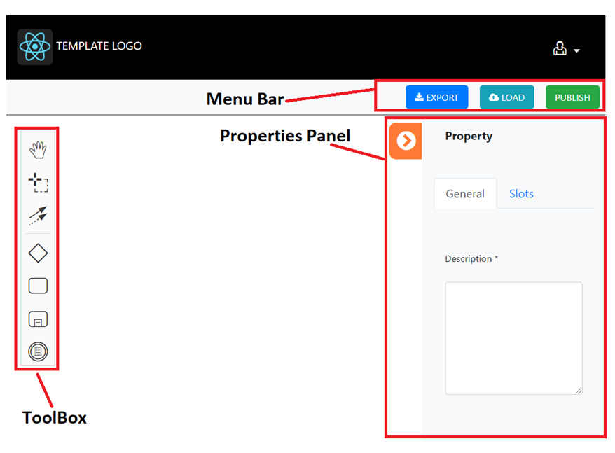
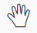
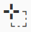
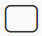
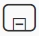
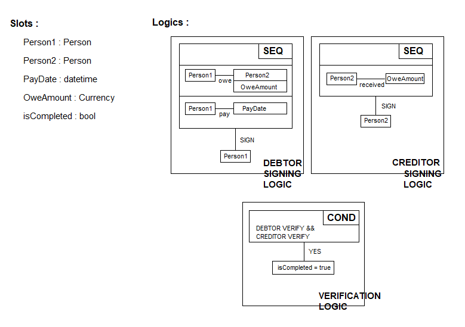

# Template Building User’s Guide 

### Contents

1.	Template Structure  
  1.1	ToolBox  
  1.2	Properties Panel  
  1.3	Menu Bar  
2.	Template Building Example  
  Contract Description  
  Template Description  
  Keyboard Shortcut and Mouse Action for Template editing  

 
### 1.	Template Structure

  

#### 1.1	ToolBox  
##### Hand Tool  
  Freely navigate without accidentally moving elements.  
##### Selection Tool  
  Select multiple diagram elements at the same time.  
##### Node Tool  
  Create the Node Object element for point-to-point connections.  
  - Default Node  
  - Action Node  
  This option would be enabled only when it must be started from “Slot Object” whose the type is “person” or “authority”.  
  This contains 4 options as following.  
    - Sign  
    - Verify  
    - Transfer  
    - Deposit  
##### Gateway Tool  
  Create the Gateway Object element  
  This will determine “Logical And”, “Logical OR” and multiple “Slot Object” will be compared.  
  Conditional operations such as “equal to”, “not equal”, “less than” and so on will be possible.  
##### Slot Tool  
  Create the Slot Object element.  
  At first, Slot Objects must be created in root element.   
  Slot Objects created in root object element will be referenced here.  
  There’re 2 types in slot : Base Type and Extended Type  
  - Base Type  
      - string  
      - number  
      - bool  
      - address  
      - datetime  
      - asset  
  - Extended Type  
      - person  
      - money  
      - authority  
##### Grouping Tool  
  Create Grouping Object element.  
  This will be acts as container for grouping.   
  This will contain another all of the Object element including Grouping Object element.  

##### Data Management Tool  
  Create Data Process Object element.  
  - If “Action” value is “Yes”, Some facts for Slot Object will be reflected as text value.  
  - If “Action” value is “No”, the value of some Slot Object will be input.  

#### 1.2	Properties Panel

  Properties Panel is one for editing and saving the details value of all Object elements created.  
  - If they click on the Object element to edit, corresponding properties panel will be displayed.  
  - If then didn’t select any Object element, properties panel for root element will be displayed  
  Slot Object could be created in root element panel and they will be referenced to create the Slot Object element.  

#### 1.3	Menu Bar

    They can save current diagram as the XML file and continue working on this diagram at a later time by uploading the XML file saved.  
 
    Create a new diagram from an .xml file.  

### 2.	Template Building Example

#### Contract Description

  - ‘Person_1’ signs the fact 1 as following  
    - ‘Person_1’ owes ‘Person_2’ ‘OweAmount’.  
    - ‘Person_1’ pays ‘Person_2’ ‘OweAmount’ by ‘PayDate’.  
  - ‘Person_2’ signs the fact 2 as following  
    - ‘Person_2’ received ‘OweAmount’ from ‘Person_1’  
  - If ‘Person_1’ and ‘Person_2’ signs respectively fact1 and fact 2, the contract will be valid.  
#### Template Description

We can assume that template diagram for above contract will be built as following.  
But the diagram may vary slightly depending on the maker  

  
 

Diagram will be made of in following order in Web program.  
  - Create the slots object in root element  
    If the Web program to build the template is run first, root element properties panel will be displayed in that Web Page.  
    Here, by clicking on the “Slot” tab and “Add New”, create the following slots objects to be referenced later.  
    - Person_1: Person  
    - Person_2: Person  
    - PayDate: datetime  
    - OweAmount: Currency  
    - isCompleted: bool  
  - Refer to the above objects to create the Slot Object elements  
  - After that, build the diagram with these as you want.  

#### Keyboard Shortcut and Mouse Action for Template editing

Copy the Object : Ctrl + C  
Paste the Object : Ctrl + V  
Select the Object : mouse click  
Move the Object : mouse click and drag  
Zoom : Ctrl + scroll  
Scroll up : ↑(up arrow) or mouse scroll up  
Scroll down : ↓(down arrow) or mouse scroll down  

